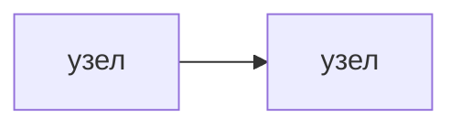
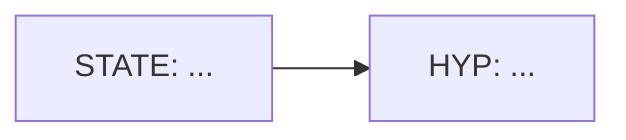

# hypothesis-map-builder

Назначение: построение «Карты гипотез» для любого клиентского/внутреннего проекта или процесса.

Скилл делает две вещи:
1) Создаёт черновик карты в vault (структура + поля для заполнения).
2) Даёт «контур проверки» гипотез через процессы консультанта (BPM/BPO и т.п.) и ось «9 рычагов».

## Визуальный язык (канон v0.1, закреплено 29/04/2026)

Это обязательный визуальный язык для карт гипотез (как в «Карта гипотез ROSMA»), чтобы стиль не «гулял».

Принципы:
1) **Тип узла = заливка. Центр ответственности = рамка/ярлык.** Не смешивать эти две оси.
2) **Support ≠ Verify.** Повторы/внутренние источники делают гипотезу сильной, но верификацию делаем через BPM-классы, дающие внешнюю/объективируемую фактологию (рынок/конкуренты/данные).
3) **No-control не порождает “решение” напрямую.** Из no-control допускаем только ветки компенсаторных мер (mitigation) и снятия ограничений (если применимо).

### Центры ответственности (рамка/ярлык)

- `G` зелёный центр
- `Y` жёлтый центр
- `B` синий центр
- `R` красный центр

Реализация:
- у узла есть небольшой ярлык (`G/Y/B/R`) и/или толстая рамка соответствующего цвета.

### Типы узлов (заливка)

- `STATE` — текущее негативное/позитивное состояние (цель или проблема верхнего уровня)
- `EVIDENCE-PACK` — “пакет фактуры” (контейнер/место хранения тезисов; внутри — конкретные тезисы)
- `EVIDENCE` — конкретный тезис/факт (не место хранения)
- `CLAIM` — утверждение (в т.ч. “клиент сказал”), которое делает гипотезу сильнее, но само по себе не является evidence
- `HYPOTHESIS` (`HYP`) — проверяемая гипотеза (с сентиментом)
- `QUALIFIER` — контрфакт/уточнение (не “опровергает”, а меняет режим работы/тактику)
- `CONSTRAINT` — ограничение/`no_control`
- `MITIGATION` — компенсаторная мера под `CONSTRAINT`
- `GATE` — точка отбора “берём в проверку”
- `VERIFY (BPM/BPO)` — проверка (обязательная объективизация)
- `MEASURE` — что будем измерять/какие критерии “доказано”
- `ENABLER` — инфраструктурный/организационный усилитель (данные/тепловизор/ритмы и т.п.)
- `INITIATIVE` — инициатива/проект (что запускаем)

### Символы и связи (стрелки/подписи)

- `▼` у `STATE`/`HYP`: негатив (плохо)
- `▲` у `STATE`/`HYP`: позитив (цель/сила)
- `◇` у `STATE`/`HYP`: неоднозначно (требует уточнения)
- `+` на связи: подтверждает/усиливает (support)
- `-` на связи: ослабляет
- `⚡` на связи/между узлами: конфликт/противоречие (надо проверить)

Для “Support vs Verify”:
- связи от `EVIDENCE/CLAIM/EVIDENCE-PACK` к `HYP` помечаем как `+` (support)
- связи от `HYP` к `VERIFY` подписываем `verify via` и это **обязательная** стрелка для сильных гипотез

### Ватерлиния

Обязательный разделитель:
- **выше ватерлинии**: состояние → гипотезы → фактура/пакеты → gate
- **ниже ватерлинии**: verify/measure/enabler/initiative (контуры проверки и исполнения)

### Mermaid-шаблон (для быстрых схем в чате)

Использовать как базовый каркас (дальше добавлять узлы/связи):

### Obsidian render contract (обязательно)

Любая карта гипотез, которую скилл строит или обновляет, **всегда** должна иметь Mermaid-версию. Это не опция и не “если попросили”: без раздела `## Mermaid-карта` результат считается незавершённым.

Если Mermaid-карта должна **отображаться визуально в Obsidian**, она всегда должна быть записана как отдельный fenced-блок:

````md

````

Правила, которые нельзя нарушать:
- открывающая строка — строго ```` ```mermaid ````; не ```` ``` ```` и не ```` ```mmd ````;
- перед ```` ```mermaid ```` не должно быть отступов, `>` цитаты, пункта списка или таблицы;
- внутри Mermaid-блока не использовать Markdown-заголовки (`##`), обычный текст, списки и комментарии Markdown; комментарии только Mermaid-формата `%%`;
- в конце обязательно закрыть блок строкой ```` ``` ````;
- один Mermaid-блок не вкладывать внутрь другого код-блока;
- если карта отдаётся в чат, она тоже должна идти fenced-блоком `mermaid`, а не просто строками `flowchart LR`;
- если Obsidian показывает серый моноширинный текст, значит это обычный code block: почти всегда забыто слово `mermaid` после первых трёх бэктиков.

```mermaid
flowchart LR
  %% заливки (типы узлов)
  classDef STATE fill:#e9f7ef,stroke:#333,color:#111;
  classDef EPACK fill:#f4f6f8,stroke:#333,color:#111;
  classDef EVID fill:#f4f6f8,stroke:#333,color:#111;
  classDef CLAIM fill:#f4f6f8,stroke:#333,color:#111,stroke-dasharray:4 3;
  classDef HYP fill:#ffffff,stroke:#333,color:#111;
  classDef QUAL fill:#ffffff,stroke:#333,color:#111,stroke-dasharray:6 3;
  classDef CONSTRAINT fill:#ffecec,stroke:#333,color:#111;
  classDef MITIGATION fill:#fff6cc,stroke:#333,color:#111;
  classDef GATE fill:#ffffff,stroke:#333,color:#111;
  classDef VERIFY fill:#d9ecff,stroke:#333,color:#111;
  classDef MEASURE fill:#ffe0b2,stroke:#333,color:#111;
  classDef ENABLER fill:#eadcff,stroke:#333,color:#111;
  classDef INIT fill:#d9ecff,stroke:#333,color:#111;

  %% рамки (центры)
  classDef cG stroke:#2d7d46,stroke-width:3px;
  classDef cY stroke:#b68b00,stroke-width:3px;
  classDef cB stroke:#1e5a8a,stroke-width:3px;
  classDef cR stroke:#a33,stroke-width:3px;
```

Примечание: Mermaid ограничен по “ярлыкам” и сложным значкам внутри связи; если нужен полный вид “как на картинке” — держим канон в виде диаграмм/картинок в Vault и используем Mermaid как рабочий быстрый слой.

## Когда вызывать

Триггеры:
- `карта гипотез`
- `hypothesis map`
- `собери стратегию гипотезами`
- `структурируй цель и гипотезы`

## Вход (минимум)

- Где строим карту: проект / процесс.
- Цель (одна фраза) или ссылка на ПВЦЗ/цели проекта.

## Опора (source of truth)

- Notion: «9 рычагов» (артефакты + ритмы на каждом рычаге)
  - https://app.notion.com/p/2e5b21994da780e587caf84f010987bc
- Notion: процессы консультанта (BPM/BPA/BPI/BPO)
  - пример: BPM-6 (кабинетный анализ/конкуренты) https://app.notion.com/p/2e8b21994da780e58749f9af0c087ce3
  - пример: BPO Organisation (RUN/CHANGE/DISRUPT/FIX) https://app.notion.com/p/2e5b21994da7804d979ec36eaa7a0d17

## Результат (файлы)

Каждая карта гипотез, предназначенная для Vault/Obsidian, **всегда** содержит два слоя:

1. Содержательный текстовый слой: цель, ПВЦЗ/опоры, гипотезы, проверки, приоритизация.
2. Визуальный слой: отдельный раздел `## Mermaid-карта`, внутри которого лежит **ровно один** fenced-блок `mermaid`.

Шаблон обязательного визуального слоя:

````md
## Mermaid-карта


````

Запрещено:
- оставлять `flowchart LR` как обычный текст;
- писать карту в блоке ```` ``` ```` без языка `mermaid`;
- писать карту в `.mmd`-стиле внутри заметки без fenced-блока;
- вкладывать Mermaid-блок в список, цитату, таблицу или другой код-блок.

Перед завершением работы по карте проверить заметку:
- в файле есть строка ```` ```mermaid ````;
- первая строка внутри блока — `flowchart`;
- блок закрыт строкой ```` ``` ````;
- в Mermaid нет Markdown-заголовков, списков и таблиц.

### Если указан проект 4-го отдела

Создаём:
- `Vault/10-отделы/04-производство/Проекты/<Проект>/Анализ/<ДД-ММ-ГГГГ>-карта-гипотез.md`

Автоподтяжка:
- пытаемся вытащить блок ПВЦЗ и архетип из `00-Карточка проекта.md` (если файл есть).

### Иначе (внутренний процесс / общий случай)

Создаём:
- `Vault/60-отчёты/входящие/<ДД-ММ-ГГГГ>-карта-гипотез-<slug>.md`

## Запуск

```bash
python3 scripts/hypothesis_map_scaffold.py --project-path "Vault/10-отделы/04-производство/Проекты/<Проект>"
```

или

```bash
python3 scripts/hypothesis_map_scaffold.py --title "Карта гипотез: <тема>" --goal "<цель одной строкой>"
```

## Как работать с черновиком

Заполняем сверху вниз:
1) Цель (метрика + горизонт).
2) 9 рычагов: на каждый рычаг 1–5 гипотез (не больше).
3) Для каждой гипотезы обязательны:
   - «почему верим» (фактура),
   - «что должно быть истинно» (предпосылки),
   - «как проверим» (какой BPM/какой сигнал),
   - «следующий шаг» (что делаем, если подтверждается).

В конце — приоритизация по матрице «Важность × Неопределённость».
