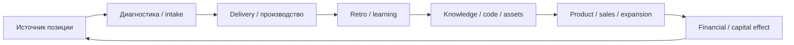

# Leverage Builder

## Назначение

`leverage-builder` помогает собирать новые стратегические / финансовые рычаги PP по каноническому паттерну, который уже сложился в финансовом и стратегическом рычагах 2026-2029.

Скилл не пишет "ещё один красивый раздел". Он собирает рычаг как управляемую систему:

```text
позиция / гипотеза
-> ставки победы
-> макробандлы A-G
-> инициативы
-> шкала зрелости инициатив
-> activity system
-> метрики / посредники
-> финансовый переводчик
-> gates
-> data gaps
-> трассировка в отделы / документы
```

## Когда использовать

- `/leverage-builder`, `$leverage-builder`
- "собери рычаг"
- "разверни следующий рычаг"
- "собери стратегический / финансовый / IT / HR / клиентский рычаг"
- "свяжи инициативы с финансовым рычагом"
- "сгруппируй стратегические инициативы"
- "построй activity system map"
- "сверь рычаг с пирамидой метрик / партнёрской сессией / benchmark"
- "разложи 9 рычагов"
- "покажи, какие бандлы активностей поддерживают рычаг"
- "покажи уровни зрелости инициатив"
- "сделай maturity ladder / матрицу зрелости"

## Не использовать

- Для короткого коммюнике партнёрам — использовать `rsvp`.
- Для общей выжимки чата — использовать `summary`.
- Для маршрутизации знания по Vault — использовать `tunnel`.
- Для процессной рефлексии агента — использовать `meditate`.
- Для постановки задач — использовать `cordos`.

## Опорные документы

Перед содержательным выводом или правкой проверить актуальные файлы, если они есть в Vault:

| Документ | Зачем нужен |
|---|---|
| `02-стратегия-2026-2029/15_Финансовый_рычаг_2026-2029.md` | финансовые бандлы, revenue mix, leakage, forecast, productivity, ICF |
| `02-стратегия-2026-2029/19_Стратегический_рычаг_2026-2029.md` | стратегический паттерн: ставки, позиция, gates, APQ, activity system |
| `Пирамида метрик компании 2026-2029.md` | метрики, пиллары, диагностические вопросы, measurement gaps |
| `_inbox/2026-05-07-партнёрская-сессия-рабочий-багаж.md` | партнёрские обязательства, домены, system-supported execution |
| `02-стратегия-2026-2029/17_Lack_of_data_финстратегии_для_интегрированного_дашборда.md` | gaps, которые нужно пополнять |
| `02-стратегия-2026-2029/18_Гайд_квартальной_сессии.md` | gate / stop-go / quarterly review логика |

Не опираться только на память, если документ мог измениться.

## Канонические бандлы A-G

Использовать как финансово-управленческий каркас рычага:

| Код | Бандл | Диагностический вопрос |
|---|---|---|
| A | Revenue architecture | из чего появится будущая выручка и какой revenue mix меняется |
| B | Client expansion / LTV | как растёт ценность клиента после первого входа |
| C | Margin & leakage control | где создаётся и где утекает маржа |
| D | Forecast / cash / working capital | как план, прогноз, факт и деньги становятся видимыми |
| E | Productivity / capacity / leverage | как растёт отдача людей, ролей, AI, методологии и delivery |
| F | Asset utilization / APQ | какие активы уже есть и как поднять availability / performance / quality |
| G | Capital allocation / ICF | как прибыль превращается в будущие активы, option-ставки и капитал |

## Сборка рычага

### 1. Назвать предмет и границу

Сначала определить:

- какой это рычаг из 9 рычагов или какой домен стратегии;
- что входит в границу;
- что явно не входит;
- какие уже принятые документы нужно не противоречиво унаследовать.

### 2. Сформулировать стратегическую гипотезу

Формат:

```text
Если PP делает X для Y через Z, то меняется A/B/C/D/E/F/G, потому что ...
```

Для конкурентной стратегии добавлять:

- лучший клиент / ICP;
- альтернативы клиента;
- right to win;
- where-not-to-play;
- trade-offs.

### 3. Разложить ставки победы

Ставка победы — не задача и не метрика. Это пакет изменений, который должен создать новую способность компании.

Минимальная таблица:

| Ставка | Что должно измениться | Бандлы A-G | Как проверить |
|---|---|---|---|

### 4. Сгруппировать инициативы

Не делать длинную плоскую простыню. Группировать в 5-8 управленческих пакетов:

- revenue / product / market;
- client expansion;
- margin / leakage;
- capacity / people / AI;
- knowledge / code / methodology;
- assets / APQ;
- capital / ICF;
- governance / data / forecast.

Для каждой группы показать:

| Группа инициатив | Что внутри | Главные бандлы | Финансовый смысл |
|---|---|---|---|

### 4.1. Добавить матрицу зрелости

Если рычаг описывает практики, которые уже существуют хотя бы частично, не строить его как плоский план "в каком году начнём". Вместо этого добавить maturity ladder: **что уже есть и до какого уровня зрелости должно вырасти**.

Базовая шкала PP:

| Уровень | Смысл |
|---|---|
| L0 | не выделено как объект управления |
| L1 | названо: есть гипотеза, ставка или первичное решение |
| L2 | повторяется вручную: есть удачные кейсы, но всё держится на людях |
| L3 | стандартизировано: есть owner, trace, шаблон, gate, intake, retro или минимальный стандарт |
| L4 | управляется: есть метрики, review, decision log, APQ, PnL, forecast, leakage или другой контур проверки |
| L5 | стратегический актив: практика масштабируется, усиливает соседние рычаги и даёт устойчивое преимущество |

Минимальная таблица:

| Инициатива / ставка | Текущий уровень | Цель 2026 | Цель 2027 | Цель 2028 | Цель 2029 | Evidence для перехода вверх |
|---|---|---|---|---|---|---|

Если пользователь собирается оценивать текущий уровень с коллегами, оставлять `Текущий уровень = оценить с партнёрами / коллегами`, а не присваивать зрелость от имени агента.

Правило: годовая рамка зрелости не должна подменять финансовую траекторию. Она объясняет, какая организационная способность должна появиться, чтобы финансовая траектория не держалась только на ручном усилии партнёров.

### 5. Построить activity system

Если рычаг претендует на стратегический уровень, показать не только список инициатив, но и fit активностей.

Текстовый паттерн:

```text
ICP / источник ценности
-> диагностика / intake
-> delivery / производство
-> learning / retro
-> knowledge / code / assets
-> product / sales / client expansion
-> financial / capital effect
-> усиление исходной позиции
```

Если пользователь просит визуализацию или документ пригоден для визуальной вычитки, встроить Mermaid:



### 6. Связать с метриками

Для каждой ставки определить:

| Ставка | Метрика-посредник | Финансовый переводчик | Где проверяем |
|---|---|---|---|

Правило: если у ставки нет operating proxy, её нельзя честно защищать как стратегическую. Она остаётся гипотезой / watch / option.

### 7. Добавить gate-логику

До scale-решения должен быть понятен gate:

- owner;
- maturity stage;
- source signal;
- пилот / evidence;
- экономика или стратегическая полезность;
- capacity check;
- stop / hold / scale / redesign decision;
- next review date.

### 8. Зафиксировать data gaps и трассировку

Если данных нет, не скрывать это. Разнести:

- в пирамиду метрик, если меняется логика метрики;
- в lack-of-data, если нужен источник / датасет;
- в трассировки отделов, если нужно изменить бизнес-процесс;
- в quarterly review, если решение должно регулярно пересматриваться;
- в CORD через отдельный акцепт пользователя, если нужно завести задачу.

## Правила наследования

- Не смешивать revenue type, source, channel, delivery model и client-development mechanism.
- CODE-INTERNAL по умолчанию относится к снижению leakage / productivity, а не к revenue.
- CODE-EXTERNAL относится к домену "Код" и требует паспорта продукта.
- Инкубаторы — ICF-G / option-ставки; pipeline, equity / option value и подтверждённая выручка не суммируются как один результат.
- Повторная сделка, Cross-L, New Delivery renewal и dormant reactivation — разные механики.
- APQ — не псевдоточная KPI-магия, а review-рамка для активов, пока не принят отдельный score.
- Финансовый эффект должен иметь мост: `initiative -> operating proxy -> financial translator -> PnL / cash / retained capital / ICF`.
- Исторические годы не пересчитывать задним числом по новой модели без явной команды.

## Формат ответа в чате

Если пользователь просит обсудить в чате, не править файлы. Давать:

1. краткую рамку;
2. таблицу групп инициатив;
3. связь с A-G;
4. 3-5 главных выводов;
5. вопросы / решения, которые нужно закрыть.

## Формат правки документа

Если пользователь просит внести в файл:

1. не переписывать радикально без команды;
2. добавлять акценты, таблицы, gates и мосты в существующие разделы;
3. после правки перечитать на противоречия с финансовым рычагом и пирамидой метрик;
4. явно сказать, какие файлы обновлены и какие gaps остались.

## Проверка качества

Готовый рычаг должен отвечать на 10 вопросов:

1. Что это за рычаг и где его граница?
2. Какая стратегическая гипотеза?
3. Какие ставки победы?
4. Какие инициативы сгруппированы в пакеты?
5. Какие бандлы A-G они усиливают?
6. Какой уровень зрелости инициатив нужен в 2026-2029 и чем это подтверждается?
7. Как выглядит activity system?
8. Какие operating proxy и финансовые переводчики?
9. Какие gates и stop/go decisions?
10. Какие data gaps, трассировки и следующие решения?

interface:
  display_name: "Leverage Builder"
  short_description: "Сборка стратегических рычагов PP"
  default_prompt: "Use $leverage-builder to build or audit a PP strategy lever through hypotheses, A-G financial bundles, initiatives, maturity levels, metrics, gates, activity system, and data gaps."
